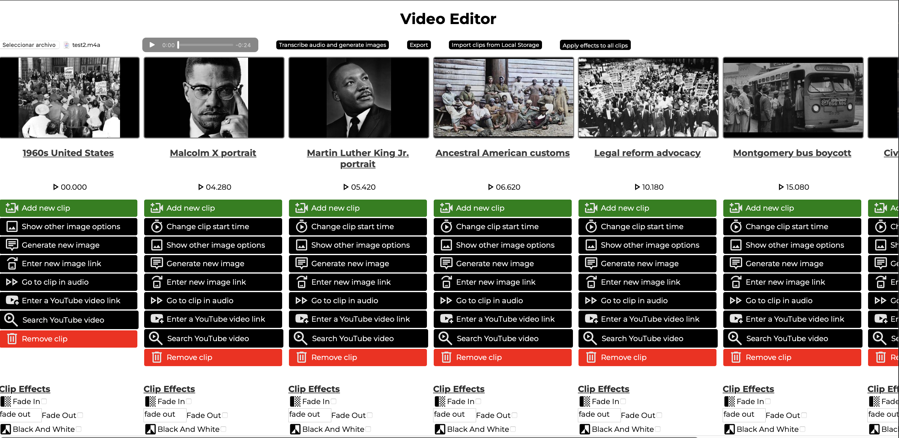
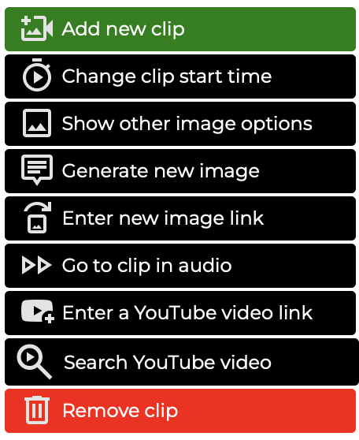

<h1>AUDIO TO VIDEO AI EDITOR</h1>

  Audio to Video AI Editor is a web-based editor built with <strong>Vanilla JS</strong> and <strong>Python Flask</strong>. 
  It allows you to upload an audio file of yourself speaking, and automatically generates image or video clips that correspond to your audio. 
  This eliminates the need to manually search for and insert images into your videos.

<h2>LICENSE</h2>

This project is licensed under the <a href="https://creativecommons.org/licenses/by-nc-nd/4.0/legalcode" target='_blank'>Creative Commons Attribution-NonCommercial-NoDerivatives 4.0 International License (CC BY-NC-ND 4.0)</a>.
Modifications are only allowed if contributed directly back to the original repository via a Pull Request. Commercial use is strictly prohibited.

<h2>HOW IT WORKS</h2>

  1. When an audio file is uploaded, a <strong>Whisper</strong> model transcribes the audio with timestamps using 
  <a href="https://github.com/linto-ai/whisper-timestamped" target="_blank">Linto's Whisper Library</a>. 
  2. The transcription is then sent to an <strong>LLM</strong> (default: Gemma3:12B, configurable in <a href="#configure">Configuration</a>), which generates image/video description queries.  
     Examples:  
     - Image: "1960s Bus Boycott, Black and White"  
     - Video: "Historical footage of MLK" 
  3. Using these descriptions, the server fetches images from the internet via <a href="https://duckduckgo.com" target="_blank">DuckDuckGo</a> and displays them to the user. 
  4. The entire process is automatic; only the audio upload is required.

<h2>INSTALLATION</h2>

<ol>
  <li>
    <strong>Clone the repository:</strong> 
    <code>git clone https://github.com/lucabae/video-editor</code> 
    <code>cd video-editor</code>
  </li>

  <li>
    <strong>Set up a virtual environment (recommended):</strong> 
    It is highly recommended to use <strong>Python 3.9</strong> for compatibility. 
    <code>python3.9 -m venv venv</code> 
    Linux/macOS:
    <code>source venv/bin/activate</code> 
    Windows:
    <code>venv\Scripts\activate</code> &nbsp; 
  </li>

  <li>
    <strong>Install backend dependencies:</strong> 
    <code>pip install -r backend/requirements.txt</code>
  </li>

  <li>
    <strong>Run the backend server:</strong> 
    <code>cd backend</code> 
    <code>python server.py</code> 
    The Flask server will start, usually at <code>http://127.0.0.1:8000</code>
  </li>
  
  <li>
    <strong>Open the frontend:</strong> 
    Open <code>frontend/index.html</code> in your browser to start using the editor.
  </li>
</ol>

<h2>HOW TO USE</h2>

  1. Select an audio file in the top-left corner. 
  2. Click <strong>"Transcribe audio and generate images"</strong> and wait (this may take some time). 
  3. Edit the generated clips using the <a href="#editor">editor</a>. 
  4. Click <strong>"Export"</strong> when finished (this may also take some time). 
  5. The final video will be saved in: <code>backend/result.mp4</code>.

<h2 id="editor">EDITOR FEATURES</h2>

  After clips are generated, you can freely modify your video.

<h3>Available Features</h3>
<ul>
  <li><strong>Video Effects:</strong> Apply effects to individual clips or all clips.</li>
  <li><strong>Add New Clip:</strong> Create clips with custom image descriptions.</li>
  <li><strong>Change Clip Start Time:</strong> Adjust start time in seconds:milliseconds format.</li>
  <li><strong>Show Other Image Options:</strong> Browse alternative images and apply the one you like.</li>
  <li><strong>Generate New Image:</strong> Enter a new search query to get another image.</li>
  <li><strong>Enter Image URL:</strong> Replace the current clip image with a custom link.</li>
  <li><strong>Go to Clip in Audio:</strong> Play the audio corresponding to a clip.</li>
  <li><strong>Enter YouTube Link:</strong> Download and trim a YouTube video based on timestamps; duration matches until the next clip.</li>
  <li><strong>Search YouTube Video:</strong> Opens a YouTube search with the LLM-generated description for more accurate results.</li>
  <li><strong>Remove Clip</strong></li>
</ul>

<h2 id="configure">CONFIGURATION</h2>

  Configuration file: <code>backend/config.json</code> 
  Available options:

<ul>
  <li><strong>PROJECT_FPS</strong> (default: 30)</li>
  <li><strong>OLLAMA_MODEL</strong> (default: gemma3:12b) – Handles all text processing; downgrading is not recommended.</li>
  <li><strong>WHISPER_MODEL</strong> (default: base) – <a href="https://github.com/openai/whisper?tab=readme-ov-file#available-models-and-languages" target="_blank">See available models and languages</a>.</li>
  <li><strong>WHISPER_LANGUAGE</strong> (default: "es")</li>
  <li><strong>CLIPS_PER_SENTENCE</strong> (default: 1)</li>
</ul>

<h2 id="contributions">CONTRIBUTIONS</h2>

Contributions are highly appreciated. You can help with:

<ul>
  <li>Adding new MoviePy effects</li>
  <li>Improving documentation and overall clarity</li>
  <li>Design enhancements for the web UI</li>
  <li>Any relevant code modifications</li>
</ul>
